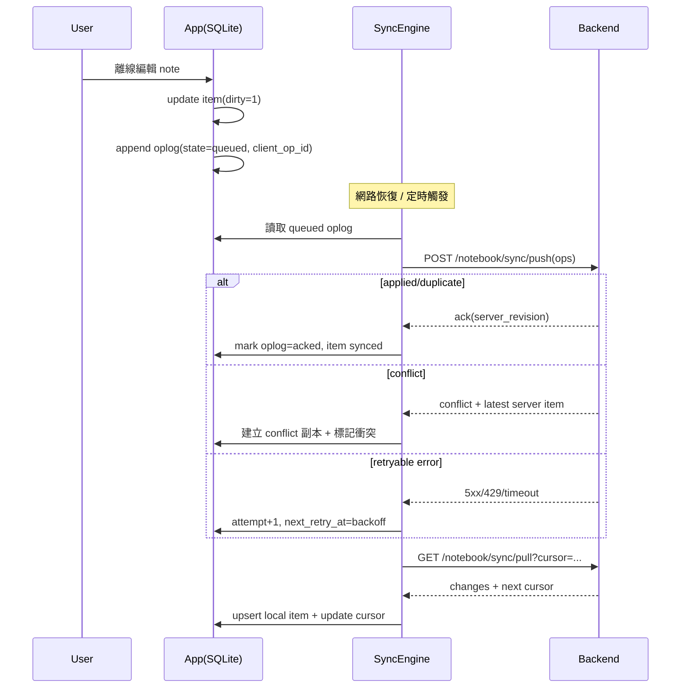

# Notebook App 端離線與同步規格（APP-01~APP-04）

版本: v1.0  
日期: 2026-02-16  
範圍: `APP-01 本地 SQLite 結構`、`APP-02 離線讀寫`、`APP-03 自動同步引擎`、`APP-04 衝突 UI`  
不含: 聊天 AI 邏輯與 Assist API 行為修改

## 1. 設計目標
- 離線可讀寫（手機/App 端、應用端一致）
- 回線後自動 push/pull 同步
- 同步可重試、具退避策略、可恢復
- 以 `client_op_id` 保證幂等，不重複寫入
- 衝突必須可見且可處理，不可靜默覆蓋

## 2. 本地 SQLite Schema（APP-01）

> 本地 SQLite 為操作層；雲端 Postgres 為權威層。  
> 最小必備表: `item`、`oplog`、`cursor`。

### 2.1 `notebook_item_local`（item）
```sql
CREATE TABLE IF NOT EXISTS notebook_item_local (
  item_id TEXT PRIMARY KEY,                        -- UUID
  company_id TEXT NOT NULL,
  owner_user_id TEXT NOT NULL,
  title TEXT NOT NULL DEFAULT '',
  content_markdown TEXT NOT NULL DEFAULT '',
  item_type TEXT NOT NULL CHECK (item_type IN ('text','file')),
  status TEXT NOT NULL CHECK (status IN ('active','deleted')) DEFAULT 'active',
  revision INTEGER NOT NULL DEFAULT 0,             -- 本地已知 server revision
  server_updated_at TEXT,                          -- ISO8601, 最後一次 server 版本時間
  local_updated_at TEXT NOT NULL,                  -- ISO8601, 本地最後修改時間
  dirty INTEGER NOT NULL DEFAULT 0,                -- 1=有未同步變更
  sync_state TEXT NOT NULL DEFAULT 'synced'
    CHECK (sync_state IN ('synced','pending_push','syncing','conflict')),
  conflict_group_id TEXT,                          -- 衝突群組 id，用於 UI 聚合
  is_conflict_copy INTEGER NOT NULL DEFAULT 0,     -- 1=衝突副本（保留敗方內容）
  base_revision INTEGER NOT NULL DEFAULT 0,        -- 此次本地修改基於哪個 revision
  created_at TEXT NOT NULL,
  updated_at TEXT NOT NULL
);

CREATE INDEX IF NOT EXISTS idx_notebook_item_local_owner_updated
  ON notebook_item_local(owner_user_id, updated_at DESC);
CREATE INDEX IF NOT EXISTS idx_notebook_item_local_dirty
  ON notebook_item_local(dirty, updated_at);
CREATE INDEX IF NOT EXISTS idx_notebook_item_local_conflict
  ON notebook_item_local(sync_state, conflict_group_id);
```

### 2.2 `notebook_sync_oplog`（oplog）
```sql
CREATE TABLE IF NOT EXISTS notebook_sync_oplog (
  client_op_id TEXT PRIMARY KEY,                   -- 幂等鍵（UUIDv7 建議）
  device_id TEXT NOT NULL,
  company_id TEXT NOT NULL,
  owner_user_id TEXT NOT NULL,
  item_id TEXT NOT NULL,
  op_type TEXT NOT NULL CHECK (op_type IN ('create','update','delete')),
  payload_json TEXT NOT NULL,                      -- 變更內容（title/content/status...）
  base_revision INTEGER NOT NULL DEFAULT 0,        -- 客戶端認知的 server revision
  client_ts TEXT NOT NULL,                         -- 客戶端操作時間
  attempt_count INTEGER NOT NULL DEFAULT 0,
  next_retry_at TEXT,                              -- 下次允許重試時間
  state TEXT NOT NULL DEFAULT 'queued'
    CHECK (state IN ('queued','inflight','acked','failed_retryable','failed_fatal')),
  last_error_code TEXT,
  last_error_message TEXT,
  acked_server_revision INTEGER,
  acked_server_updated_at TEXT,
  created_at TEXT NOT NULL,
  updated_at TEXT NOT NULL
);

CREATE INDEX IF NOT EXISTS idx_notebook_sync_oplog_state_retry
  ON notebook_sync_oplog(state, next_retry_at, created_at);
CREATE INDEX IF NOT EXISTS idx_notebook_sync_oplog_item
  ON notebook_sync_oplog(item_id, created_at);
```

### 2.3 `notebook_sync_cursor`（cursor）
```sql
CREATE TABLE IF NOT EXISTS notebook_sync_cursor (
  scope_key TEXT PRIMARY KEY,                      -- 建議: company_id:owner_user_id
  pull_cursor TEXT,                                -- server 下發 cursor / token
  last_successful_pull_at TEXT,
  last_successful_push_at TEXT,
  last_full_sync_at TEXT,
  last_error_code TEXT,
  last_error_message TEXT,
  updated_at TEXT NOT NULL
);
```

## 3. 同步協議（APP-03）

## 3.1 Push API
- `POST /notebook/sync/push`
- 請求（批次）:
```json
{
  "device_id": "ios-iphone15-a1",
  "company_id": "c-uuid",
  "owner_user_id": "u-uuid",
  "ops": [
    {
      "client_op_id": "01J...UUIDV7",
      "item_id": "i-uuid",
      "op_type": "update",
      "base_revision": 7,
      "client_ts": "2026-02-16T08:00:00Z",
      "payload": {
        "title": "new title",
        "content_markdown": "..."
      }
    }
  ]
}
```

- 回應（逐筆）:
```json
{
  "results": [
    {
      "client_op_id": "01J...UUIDV7",
      "status": "applied",
      "item_id": "i-uuid",
      "server_revision": 8,
      "server_updated_at": "2026-02-16T08:00:01Z"
    }
  ]
}
```

- `status` 枚舉:
  - `applied`: 正常套用
  - `duplicate`: 幂等命中（同 `client_op_id` 已處理）
  - `conflict`: server 檢測與當前 revision 衝突
  - `rejected`: 驗證失敗（fatal）

## 3.2 Pull API
- `GET /notebook/sync/pull?cursor=<token>&limit=200`
- 回應:
```json
{
  "cursor": "next-token",
  "has_more": false,
  "changes": [
    {
      "item_id": "i-uuid",
      "company_id": "c-uuid",
      "owner_user_id": "u-uuid",
      "title": "title",
      "content_markdown": "...",
      "status": "active",
      "revision": 9,
      "updated_at": "2026-02-16T08:02:01Z"
    }
  ]
}
```

## 3.3 幂等保證（必選）
- `client_op_id` 由客戶端生成，單裝置全局唯一（UUIDv7/ULID）。
- server 對 `(company_id, owner_user_id, client_op_id)` 建唯一約束。
- 客戶端重送同一 `client_op_id`，結果需為 `duplicate` 或返回首次處理結果，最終狀態一致。

## 4. 離線讀寫流程（APP-02）
- 讀取:
  - UI 永遠先查 `notebook_item_local`。
  - `sync_state=conflict` 或 `is_conflict_copy=1` 時顯示衝突標記。
- 寫入（create/update/delete）:
  - 單 transaction 寫入 `notebook_item_local`（`dirty=1`,`sync_state=pending_push`）。
  - 同 transaction append 一筆 `notebook_sync_oplog`（`state=queued`）。
  - 回傳成功給 UI（離線立即可見）。

## 5. 自動同步引擎（APP-03）

## 5.1 觸發時機
- App 啟動後 3 秒
- 網路從 offline -> online
- 前景喚醒（resume）
- 使用者手動下拉刷新
- 定時（前景每 30 秒）

## 5.2 同步輪次
1. `push phase`: 取 `oplog.state in (queued, failed_retryable)` 且 `next_retry_at <= now` 的資料，批次送出。
2. `pull phase`: 用 `cursor` 拉取遠端增量，直到 `has_more=false`。
3. 成功更新 `cursor` 與 `last_successful_*`。

## 5.3 重試與退避（含抖動）
- 可重試錯誤: timeout、網路錯誤、HTTP `429/500/502/503/504`。
- 不可重試錯誤: HTTP `400/401/403/404/422`（標記 `failed_fatal`）。
- 退避公式:
  - `delay_ms = min(60000, 1000 * 2^attempt_count) + random(0, 250)`
  - 第 1~6 次約為 `1s/2s/4s/8s/16s/32s`，上限 `60s`
- `attempt_count` 達 12 次後轉人工提示（仍保留可手動重試）。

## 6. 衝突處理與 UI（APP-04）

## 6.1 規則
- Server 主策略: `LWW`（以 `updated_at`，若同秒則 `device_id` 字典序打破平手）。
- 但不可靜默覆蓋:  
  當客戶端 push 遇 `conflict`，必須保留本地敗方內容為「衝突副本」並可見。

## 6.2 客戶端行為
- 收到 `conflict`:
  - 建立/更新衝突副本（`is_conflict_copy=1`,`sync_state=conflict`）
  - 正本用 pull 下來的 server winner 覆蓋
  - `conflict_group_id` 相同，供 UI 成對展示
- UI 提供三種操作:
  - 保留雲端版（刪除衝突副本）
  - 保留本地版（把副本內容覆寫正本並重送新 `client_op_id`）
  - 手動合併（打開 editor 合併後存檔並重送）

## 7. 同步時序圖



## 8. 失敗重試策略（摘要）
- Push/Pull 任一失敗都不丟資料，僅變更 `oplog.state` 與 `next_retry_at`。
- 同一 `client_op_id` 永不變更，確保重送幂等。
- 每輪同步先 push 再 pull，避免本地新寫被舊遠端覆蓋。
- App 關閉重開後可從 `oplog/cursor` 恢復，不需重建狀態。

## 9. UAT 對照（UAT-09/10/11/12）

### UAT-09（應用端離線查看與編輯）
- 覆蓋點:
  - 離線讀取 `item`（本地可見）
  - 離線寫入 `item + oplog`
  - 回線自動 push/pull，資料無遺失
- 驗證指標:
  - 回線後 `dirty=0`，`oplog queued=0`（可重試錯誤除外）

### UAT-10（App 端離線查看與編輯）
- 覆蓋點:
  - 與 UAT-09 同流程，但在手機裝置
  - 冷啟後仍可看到離線已存內容（SQLite 持久化）

### UAT-11（多裝置同步一致性）
- 覆蓋點:
  - A 裝置 push 後，B 裝置 pull 取得新 revision
  - `revision` 單調遞增，不回退
- 驗證指標:
  - B 在 SLA 內看到 A 的更新

### UAT-12（同步衝突處理）
- 覆蓋點:
  - A/B 離線同改，先後上線
  - 後上線裝置出現 `conflict`，可見衝突副本
  - 使用者可選雲端版 / 本地版 / 手動合併
- 驗證指標:
  - 不可靜默覆蓋
  - 需保留衝突證據（`conflict_group_id` + 副本）

## 10. 實作邊界（避免誤改）
- 不修改聊天 AI prompt、RAG、Assist 輸出邏輯
- 僅處理 Notebook 本地資料層、同步層、衝突可視化層
