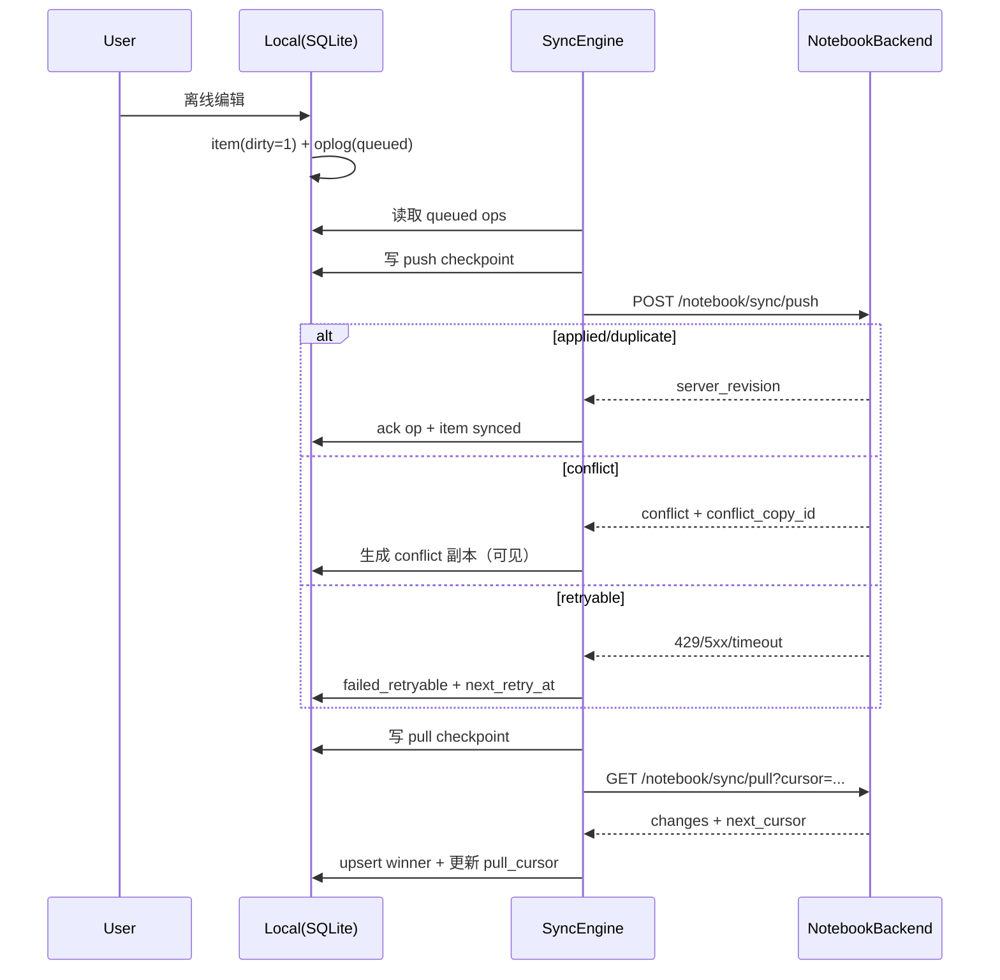

# Notebook App 端离线与同步规范（APP-01~APP-04）

版本: v1.1  
日期: 2026-02-27  
范围: `APP-01`~`APP-04`（仅离线与同步，不改聊天 AI 逻辑）

## 0. 现状约束（必须遵守）
- 2.1~2.3 已稳定，2.4 必须兼容现网接口，不做破坏性改动。
- Notebook 已区分 `source_scope`（`personal|company`）且有 `is_indexable/index_status`，离线层必须保留。
- 平台托管策略已生效，前端仅只读公司配置；2.4 不重做配置逻辑。
- token 边界不改：Matrix 仅聊天，Hub JWT 仅业务 API。

## 1. 目标
- 离线可读写（应用端/App 端一致）。
- 自动同步（push/pull），支持重试、指数退避、jitter。
- `client_op_id` 幂等，重复提交不重复落库。
- 冲突可见可处理（LWW + conflict 副本），禁止静默覆盖。
- push/pull 均支持断点续传（cursor/checkpoint）。

## 2. 本地 SQLite Schema v1（APP-01）

### 2.1 `notebook_item_local`
```sql
CREATE TABLE IF NOT EXISTS notebook_item_local (
  item_id TEXT PRIMARY KEY,
  scope_key TEXT NOT NULL,
  company_id TEXT NOT NULL,
  owner_user_id TEXT NOT NULL,

  source_scope TEXT NOT NULL CHECK (source_scope IN ('personal','company')) DEFAULT 'personal',
  title TEXT NOT NULL DEFAULT '',
  content_markdown TEXT NOT NULL DEFAULT '',
  item_type TEXT NOT NULL CHECK (item_type IN ('text','file')) DEFAULT 'text',

  is_indexable INTEGER NOT NULL DEFAULT 0,
  index_status TEXT NOT NULL DEFAULT 'pending'
    CHECK (index_status IN ('pending','running','success','failed','skipped')),

  status TEXT NOT NULL CHECK (status IN ('active','deleted')) DEFAULT 'active',
  revision INTEGER NOT NULL DEFAULT 0,
  server_updated_at TEXT,
  local_updated_at TEXT NOT NULL,

  dirty INTEGER NOT NULL DEFAULT 0,
  sync_state TEXT NOT NULL DEFAULT 'synced'
    CHECK (sync_state IN ('synced','pending_push','syncing','conflict')),

  conflict_group_id TEXT,
  is_conflict_copy INTEGER NOT NULL DEFAULT 0,
  base_revision INTEGER NOT NULL DEFAULT 0,

  created_at TEXT NOT NULL,
  updated_at TEXT NOT NULL
);

CREATE INDEX IF NOT EXISTS idx_notebook_item_local_scope_updated
  ON notebook_item_local(scope_key, updated_at DESC);
CREATE INDEX IF NOT EXISTS idx_notebook_item_local_scope_dirty
  ON notebook_item_local(scope_key, dirty, updated_at);
CREATE INDEX IF NOT EXISTS idx_notebook_item_local_scope_conflict
  ON notebook_item_local(scope_key, conflict_group_id, is_conflict_copy);
```

### 2.2 `notebook_sync_oplog`
```sql
CREATE TABLE IF NOT EXISTS notebook_sync_oplog (
  client_op_id TEXT PRIMARY KEY,
  scope_key TEXT NOT NULL,
  device_id TEXT NOT NULL,
  company_id TEXT NOT NULL,
  owner_user_id TEXT NOT NULL,

  entity_type TEXT NOT NULL CHECK (entity_type IN ('item','item_file')) DEFAULT 'item',
  item_id TEXT NOT NULL,
  op_type TEXT NOT NULL CHECK (op_type IN ('create','update','delete')),
  payload_json TEXT NOT NULL,
  base_revision INTEGER,

  client_ts TEXT NOT NULL,
  attempt_count INTEGER NOT NULL DEFAULT 0,
  next_retry_at TEXT,
  state TEXT NOT NULL DEFAULT 'queued'
    CHECK (state IN ('queued','inflight','acked','failed_retryable','failed_fatal')),

  conflict_copy_id TEXT,
  last_error_code TEXT,
  last_error_message TEXT,
  acked_server_revision INTEGER,

  created_at TEXT NOT NULL,
  updated_at TEXT NOT NULL
);

CREATE INDEX IF NOT EXISTS idx_notebook_sync_oplog_scope_state_retry
  ON notebook_sync_oplog(scope_key, state, next_retry_at, created_at);
```

### 2.3 `notebook_sync_cursor`
```sql
CREATE TABLE IF NOT EXISTS notebook_sync_cursor (
  scope_key TEXT PRIMARY KEY,

  pull_cursor TEXT,
  pull_checkpoint_cursor TEXT,

  push_checkpoint_client_op_id TEXT,
  push_checkpoint_at TEXT,

  last_successful_pull_at TEXT,
  last_successful_push_at TEXT,
  last_full_sync_at TEXT,

  last_error_code TEXT,
  last_error_message TEXT,
  updated_at TEXT NOT NULL
);
```

## 3. 同步协议 v1（对齐现网 notebook-backend）

### 3.1 Push
- `POST /notebook/sync/push`
- 请求：
```json
{
  "device_id": "ios-iphone15-a1",
  "ops": [
    {
      "client_op_id": "01J...",
      "entity_type": "item",
      "entity_id": "uuid",
      "op_type": "update",
      "base_revision": 7,
      "op_payload": {
        "title": "...",
        "content_markdown": "...",
        "item_type": "text",
        "source_scope": "personal",
        "is_indexable": true,
        "index_status": "pending",
        "status": "active"
      }
    }
  ]
}
```
- 响应：
```json
{
  "results": [
    {
      "client_op_id": "01J...",
      "status": "applied",
      "server_revision": 8,
      "conflict_copy_id": null
    }
  ],
  "server_cursor": "2026-02-27T10:00:00.000Z"
}
```

### 3.2 Pull
- `GET /notebook/sync/pull?cursor=<updated_at>&limit=200`
- 响应：
```json
{
  "changes": [
    {
      "id": "uuid",
      "company_id": "...",
      "owner_user_id": "...",
      "source_scope": "personal",
      "title": "...",
      "content_markdown": "...",
      "item_type": "text",
      "is_indexable": true,
      "index_status": "success",
      "status": "active",
      "revision": 9,
      "updated_at": "2026-02-27T10:00:01.000Z"
    }
  ],
  "next_cursor": "2026-02-27T10:00:01.000Z",
  "has_more": false
}
```

### 3.3 幂等
- `client_op_id` 为幂等键。
- 重试同一 `client_op_id`：允许返回 `duplicate` 或同等结果，最终状态一致。

## 4. 离线读写（APP-02）
- 读取：UI 始终读本地 `notebook_item_local`。
- 写入：本地事务内同时写 `item + oplog`，状态置 `dirty=1/sync_state=pending_push`。
- 字段要求：`source_scope/is_indexable/index_status` 必须本地完整保存并随 `op_payload` 上送。

## 5. 自动同步引擎（APP-03）

### 5.1 触发
- 启动后 3 秒。
- 网络恢复（offline -> online）。
- 前台恢复（resume）。
- 手动触发。
- 定时轮询（30 秒）。

### 5.2 轮次
1. Push：发送可重试窗口内的 `queued/failed_retryable`。
2. Pull：从 `pull_cursor` 拉增量，直到 `has_more=false`。
3. 更新 checkpoint/cursor。

### 5.3 失败重试策略（指数退避 + jitter）
- 可重试：超时、网络错误、HTTP `429/500/502/503/504`。
- 不可重试：HTTP `400/401/403/404/422` -> `failed_fatal`。
- 公式：`delay_ms = min(60000, 1000 * 2^attempt_count) + random(0,250)`。
- 轮次：约 `1s/2s/4s/8s/16s/32s`，上限 `60s`。

### 5.4 断点续传（cursor/checkpoint）
- Pull 断点：`pull_cursor`，并在请求前记录 `pull_checkpoint_cursor`。
- Push 断点：每批写 `push_checkpoint_client_op_id/push_checkpoint_at`。
- 崩溃恢复：按 checkpoint 重新执行，依赖 `client_op_id` 幂等保证“不重不漏”。

## 6. 冲突处理与 UI（APP-04）
- 后端策略：`LWW`。
- 客户端要求：冲突不可静默覆盖，必须可见。
- 处理：
  - push 返回 `conflict` 时，保留本地败方为 `is_conflict_copy=1`。
  - 正本等待 pull 后对齐云端 winner。
  - UI 给出：`保留云端版` / `保留本地版`。

## 7. 同步时序图


## 8. UAT 对应与实测（UAT-09/10/11/12）
- 测试脚本：`/Users/mac/Documents/github/gotradetalk-client/visitor/scripts/notebook-sync-e2e.ts`
- 执行命令：
  - `cd /Users/mac/Documents/github/gotradetalk-client/visitor && npm run test:e2e:notebook-sync`

### UAT-09 离线查看与离线编辑（应用端）
- 实测: PASS
- 证据: 脚本断网写入 -> 恢复后自动同步，`dirty` 清零。

### UAT-10 离线查看与离线编辑（App 端）
- 实测: PASS（同离线同步引擎与本地存储逻辑）
- 证据: 同一脚本验证持久化与回线同步闭环。

### UAT-11 多装置同步一致性
- 实测: PASS
- 证据: 幂等重放无重复写入，`revision` 单调递增不回退。

### UAT-12 同步冲突处理
- 实测: PASS
- 证据: 构造双端并发修改，出现 conflict 副本，执行“保留本地版”后成功回写。
