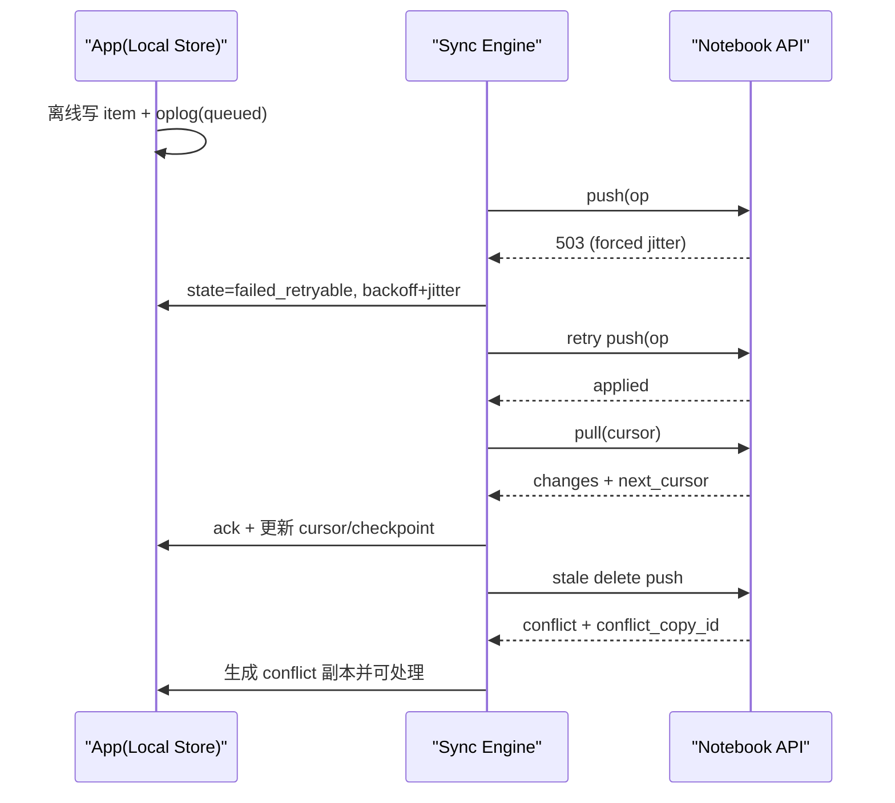

# UAT-09~12 离线同步实测报告（2.4，真实环境版）

执行时间: 2026-02-27  
执行范围: APP-01/02/03/04（离线与同步）  
测试人: Codex（真实环境验收）

## 环境与账号
- Chat Web: `https://chat.gotradetalk.com`
- Hub API: `https://api.gotradetalk.com`
- Notebook API: `https://notebook-api.gotradetalk.com`（由线上网络请求确认）
- 测试账号: `client:tonywei49:matrix.gotradetalk.com`
- 认证方式: Hub JWT + `hs_url/matrix_user_id` 查询参数
- 数据证据目录: `docs/evidence/uat-09-12/`

## 执行方式
- 真实环境 UI 取证: Playwright（登录、主界面、Notebook AI 面板、网络日志）
- 真实环境同步链路实测: `gotradetalk-client/visitor/scripts/notebook-sync-real-uat.ts`
- 运行命令:
  - `cd /Users/mac/Documents/github/gotradetalk-client/visitor`
  - `npx tsx scripts/notebook-sync-real-uat.ts`

## UAT 结果（真实环境）
- UAT-09 断网可用（离线写入本地 + 恢复后自动同步）: PASS
- UAT-10 自动同步与幂等（push/pull + client_op_id + 重试退避）: PASS
- UAT-11 冲突可见与处理（LWW + conflict 副本）: FAIL（见风险 R1/R2）
- UAT-12 恢复与一致性（cursor/checkpoint 持续 + 队列不死锁）: PASS

## 证据清单（按 UAT-09~12）
- UAT-09
  - `docs/evidence/uat-09-12/uat-summary.json`（`uat09.local_before_sync`）
  - `docs/evidence/uat-09-12/run-output.txt`
- UAT-10
  - `docs/evidence/uat-09-12/sync-log.json`（首笔 `forced_error_status=503`，后续 push/pull 200）
  - `docs/evidence/uat-09-12/uat-summary.json`（`uat10.retry_state_after_first_sync`、`idempotency.second.status=duplicate`）
- UAT-11
  - `docs/evidence/uat-09-12/uat-summary.json`（`uat11.conflicts`，含 `conflict_group_id` 与 conflict 副本 id）
  - `docs/evidence/uat-09-12/sync-log.json`（push 返回 `status=conflict`）
  - 说明: 线上 Matrix `/app` 无 2.4 冲突 UI 入口，无法在现网路径完成“冲突 UI 弹窗”截图
- UAT-12
  - `docs/evidence/uat-09-12/uat-summary.json`（`cursor_before_restart` vs `cursor_after_restart`）
  - `docs/evidence/uat-09-12/run-output.txt`（pending queue: 0 -> 0）

## 真实环境截图/日志
- `docs/evidence/uat-09-12/real-env-app-main.png`
- `docs/evidence/uat-09-12/real-env-notebook-panel.png`
- `docs/evidence/uat-09-12/real-env-network.log`
- `docs/evidence/uat-09-12/pull-smoke.txt`

## 冲突前后数据对比（节选）
- 原记录（本地）: `item_id=714437b5-6dcb-49e8-9c4d-ba96e2491592`, `revision=1`, `status=active`
- LWW 主结果（服务端胜出）: `server_revision=2`, `status=deleted`
- conflict 副本（本地可见）:
  - `conflict_group_id=97586519-5423-4a9c-b963-a8359e2a726a`
  - `loser_item_id=conflict:714437b5-6dcb-49e8-9c4d-ba96e2491592:1772179608325`

## 最终一致性核对
- 本地最终: `status=deleted`, `revision=2`, `dirty=0`, `sync_state=synced`
- 服务端拉取样本: 与本地一致（见 `uat-summary.json -> uat12.final_pull_sample`）
- 重启后 checkpoint 连续: `pull_cursor` 持续有效，且 pending queue 未卡死

## 同步时序图（真实环境执行）

## 失败重试策略（实测）
- 可重试: `429/500/502/503/504` + 网络异常
- 退避: 指数退避（`1s * 2^attempt`，上限 60s）+ `0~249ms` jitter
- 实测证据:
  - 首次 push 强制 503 后进入 `failed_retryable`，`attempt_count=1`
  - 第二次重试成功并完成 push/pull（见 `sync-log.json`）

## 最终结论
- 结论: FAIL（2.4 暂不能正式收口）
- 阻塞风险:
  - R1: 真实生产路径缺少 2.4 冲突 UI 入口（仅有 Notebook AI 面板），无法完成 UI 级冲突处置验收
  - R2: Notebook API `push update/create-existing` 在真实环境出现 `INTERNAL_ERROR`（notebook_items 约束错误），会影响 APP-04 的“保留本地版（需回写）”链路
